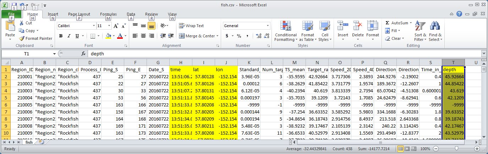

```{r setup, include=FALSE}
knitr::opts_chunk$set(
	fig.align = "center",
	fig.caption = TRUE,
	fig.height = 4,
	results = "asis"
)
```
# Introduction
This document describes the process for turning Echoview^[A product of Echoview Software Pty Ltd] hydroacoustic rockfish data into estimates of station rockfish abundance and density using the graphical and statistical analysis software R. The first step involves creating a suitable directory stocked with the necessary input files. The second step involves invoking R and then loading and correctly running the required functions. This document additionally offers a peek under the hood for anyone so inclined.

#Preliminaries
You can install the most recent version of R on your computer by visiting the R Project website at <https://www.r-project.org>. Once you have R on board, you will also need to install the R packages *zoo*, *tidyverse*, *rgdal* and *sp*. (A "package" is essentially a collection of interrelated functions and associated object definitions designed to perform a set of specific tasks.) To do this, open the **Packages** menu inside R and click on **Install package(s)...**.  Unless you have done so previously, you will be prompted to select a **CRAN mirror** from a pop-up list. Choose a location more or less nearby, e.g. NOT in Bulgaria, and click **OK**. Another pop-up list will appear. Find and select the desired package and click **OK**. Note that once a package has been installed, it must be loaded during each new R session for it to be generally available. This can be arranged either through the **Load package** option in the **Packages** menu or by using the R function `library()` with the package name, without quotes, as the argument.

# Analysis Procedure
The rockfish data analysis proceeds station by station. The methods employed assume that the hydroacoustic data come from a single "track" that includes two or more sequential line transects across an individual rockfish station area. Both "grid" and "star" tracks are supported. The grid pattern ideally yields a set of equally spaced mutually parallel transects that are perpendicular to a fixed baseline. In star sampling, transects are traversed through a fixed common central point with equal angles between them like the spokes of a wheel. In theory, star transect sampling should result in more efficient estimation of rockfish abundance and density when the distribution of fish is highly concentrated about the center of the pattern.

## Creating The Station Directory
Given that your computer is equipped with R and the R packages *zoo*, *tidyverse*, *rgdal* and *sp*, the first step in the analysis is to create a station directory containing the following six files:

1. *track.csv*
2. *fish.csv*
3. *boundary.shp*
4. *boundary.shx*
5. *boundary.dbf*
6. *boundary.prj*
7. either *baseline.csv* (grid transects) or *center.csv* (star transects)

The first two files are `csv` (comma separated value) files that contain the hydroacoustic data derived from the station track. Required covariates in the first file are ping time (hh:mm:ss.ss) and position coordinates in signed decimal degrees of latitude and longitude with corresponding column names *time*, *lat* and *lon*. Required covariates in the second file are these same three, also named *time*, *lat* and *lon*, plus *depth* expressed as a positive number in meters. The other four files are the `.shp, .shx, .dbf` and `.prj` components of the **shape file** that define the station area polygon. **Be advised that all of these name and file-type conventions are mandatory.** It is also expected that the analyst understand and be familiar with the data in these files and have exercised some reasonable level of quality control on their content. The seventh required file is another `csv` file. In the case of grid transect sampling, the file is *baseline.csv* and consists a single column *L* containing a single number giving the length in meters of the orthogonal projection of the station area onto a line perpendicular to the transects; in the case of star transect sampling, the file is *center.csv* and consists of two columns *lat* and *lon* specifying the latitude and longitude of the star pattern center in signed decimal degrees.  



## Running The Analysis in R
The tools used to analyze the rockfish hydroacoustic data are stored in the R "workspace" file *rockfish.RData*, which must be loaded into the current R session to make them available. This can be done in R either by navigating to the file through the **Load Workspace** option in the **File** menu or by using the R function `load()`. Workspace contents can then be examined using the function `ls()`. On a Windows machine, for example, you would use sequence of commands
```{r fake load workspace, eval = FALSE}
load("code/rockfish.RData")
ls()
```
```{r load workspace, include = TRUE, echo = FALSE, message = FALSE}
source("../code/rockfish.R")
ls()
```

to load the *rockfish.RData* workspace located in the *code* subdirectory of the current working directory and view a list of its contents, which consist of the three R functions `display_station_data()`, `get_haver_distance()` and `get_station_estimates()`.

The first function computes the great circle distance (km) between two points given in decimal degree latitude and longitude and is needed by the other two. The function `display_station_data()` plots the station track and area polygon with the positions of putative rockfish superimposed. Inputs are the station name, in quotes, and an optional `window` parameter specifying the the moving-average window size used to smooth track position coordinates, with default `window = 21`. The function `get_station_estimates()` computes station abundance and density estimates. Inputs to this function include those needed for function `display_station_data()`, along with the number of transects. The additional input `grid = FALSE` is required if star transect sampling was employed. Both functions automatically load the packages *zoo*, *tidyverse*, *rgdal* and *sp* provided these were previously installed; function execution will fail otherwise.  

As an example, suppose the *rockfish.RData* file has already been loaded, as above, and that the required seven files are located in a local directory associated with grid sampling of 11 transects at a station named "NEGrid33". Either navigate to the directory containing the station files via the **Change directory...** option in the **File** menu or, equivalently, enter the R command `setwd("station directory pathname")` with the appropriate pathname to make it R's current working directory. Station data can then be displayed using the command

```{r fake display data, eval = FALSE}
display_station_data("NEGrid33")
```
```{r display data, include = TRUE, echo = FALSE, message = FALSE}
setwd("../data/NEGrid33")
display_station_data("NEGrid33")

```

Station estimates of abundance and density may be obtained via the command

```{r get estimates, eval = FALSE}
get_station_estimates("NEGrid33", 11)
```
which first displays the data so that the analyst can use the cursor to delineate the individual transects by clicking on the endpoints of each one where it intersects the station boundary. The order is irrelevant so long as all defining points---in this case `11 x 2 = 22`---are selected exactly once. Note that the plot window can be resized to facilitate this process. The function then computes and returns the various estimates, which for this example are  
  
`>    station    area obs.fish dens se.dens abund se.abund    cv`  
`> 1 NEGrid33 0.33553      400 5940    3223  1993     1081 0.543`  

The results are also written to the station directory as file *estimates.csv*.


# A Quick Look Under The Hood
## Estimation Methods
Function `get.station.estimates()` estimates rockfish station abundance and density using methods that are similar to those previously developed by Barnard *et al* (citation) but arise from straightforward application of standard sampling theory and are readily described in terms of it. For both grid and star transect designs, these methods are based on an appropriately constructed Horvitz-Thompson estimator (citation). Let $i = 1, 2, ..., N$ index the N individuals comprising the rockfish population at a station of known area $A$. Given a single transect made at random in accordance with the particular design, let $T$ be the set of indices associated with the individuals encountered. The Horvitz-Thompson estimate of rockfish station abundance is \begin{equation}\label{HTN}\hat{N}=\sum_{i\epsilon T}\frac{1}{\pi_i},\end{equation} where the "inclusion probability" $\pi_i$ is the probability that individual $i$ is included among the sampled rockfish. A natural estimate of rockfish station density $D=\frac{N}{A}$ is then \begin{equation}\label{HTD}\hat{D}=\frac{\hat{N}}{A}.\end{equation} Both of these estimators are easily shown to be theoretically unbiased under repeated random selection of transects (citation). 
Suppose now that $\{\hat{N_j}\}$ is a set of $m \ge 2$ estimates of the form ($\ref{HTN}$) based on $m$ independent random transects from the particular design. By the standard theory of independent and identically distributed (i.i.d) random variables (citation), the estimator
\begin{equation}\label{MHTN}\bar{\hat{N}}=\frac{1}{m}\sum_{j=1}^{m}\hat{N_j}\end{equation} unbiasedly estimates rockfish station abundance, and an unbiased estimator of its variance is \begin{equation}\label{MHTNV}\widehat{\mathrm{Var}}(\bar{\hat{N}})=\frac{1}{m}\sum_{j=1}^{m}\frac{(\hat{N_j}-\bar{\hat{N}})^2}{m-1}.\end{equation} Station rockfish density can then be estimated by \begin{equation}\label{MHTD}\bar{\hat{D}}=\frac{\bar{\hat{N}}}{A},\end{equation} with estimated variance
\begin{equation}\label{MHTDV}\widehat{\mathrm{Var}}(\bar{\hat{D}})=\frac{\widehat{\mathrm{Var}}(\bar{\hat{N}})}{A^{2}}.\end{equation} Standard errors for the estimates of abundance ($\ref{MHTN}$) and density ($\ref{MHTD}$) are, respectively, \begin{equation}\label{SEN}SE(\bar{\hat{N}})=\sqrt{\widehat{\mathrm{Var}}(\bar{\hat{N}})}\end{equation} and \begin{equation}\label{SED}SE(\bar{\hat{D}})=\frac{1}{A}\sqrt{\widehat{\mathrm{Var}}(\bar{\hat{N}})}.\end{equation} Given a set of independent transects determined by a particular transect sampling design, whether grid or star or some other design, once the form of the estimator ($\ref{HTN}$) is determined, estimates of rockfish station abundance and density and their variances can be computed according to ($\ref{HTD}$)--($\ref{MHTDV}$), with standard errors given by ($\ref{SEN}$) and ($\ref{SED}$). The form of the Horvitz-Thompson estimator ($\ref{HTN}$) for both grid and star transect sampling is described below.

### Grid Transect Sampling
It is assumed that transects are made across the station region perpendicular to a known fixed baseline. Let $l$ be the the orthogonal projection of the station region onto the baseline and let $L$ denote its length. Suppose now that a transect is made at a point $x$ selected uniformly at random along $l$. Provided that the projected position of fish $i$ along $l$ is sufficiently far from either endpoint, the probability that fish $i$ is included in the sample is then $\pi_i=\frac{w(d_i)}{L}$, where $d_i$ is the depth of fish $i$ and $w(d_i)$ is the effective width of the hydroacoustic beam at that depth. It follows that the Horvitz-Thompson estimate ($\ref{HTN}$) of rockfish station abundance is \begin{equation}\label{GHTN}\hat{N_G}=L\sum_{i\epsilon T}\frac{1}{w(d_i)}.\end{equation} If the projected position of a fish $i$ along $l$ is such that its distance $s_i$ from either endpoint of $l$ is less than $\frac{w(d_i)}{2}$, the inclusion probability of fish $i$ is $\frac{s_i + \frac{w(d_i)}{2}}{L}$ and the corresponding term of the estimator ($\ref{GHTN}$) must be modified accordingly.     

### Star Transect Sampling
It is assumed that transects are made across the station region through a known fixed point C in its interior. Let $(r_i,~\theta_i)$ give the location of fish $i$ in polar coordinates with the point C as origin and, as above, let $d_i$ be its depth and $w(d_i)$ the effective width of the hydroacoustic beam at that depth. Provided that $r_i > \frac{w(d_i)}{2},$ a transect made through C at an angle $\psi$ selected uniformly at random from the interval $(0,~2\pi)$ will encounter an individual fish $i$ whenever one of $|\psi - \theta_i| < \sin^{-1}\left(\frac{\frac{w(d_i)}{2}}{r_i}\right)$ or $|\psi + \pi - \theta_i| < \sin^{-1}\left(\frac{\frac{w(d_i)}{2}}{r_i}\right)$ is true. It follows that the inclusion probability of such an individual is $\frac{2\sin^{-1}\left(\frac{w(d_i)}{2 r_i}\right)}{\pi},$ and the Horvitz-Thompson estimate ($\ref{HTN}$) for star transect sampling may be formulated as \begin{equation}\label{SHTN}\hat{N_S}=\frac{\pi}{2}\sum_{i\epsilon T}\frac{1}{\sin^{-1}\left(\frac{w(d_i)}{2 r_i}\right)}.\end{equation} This expression requires adjustment to account for any fish $i$ within a distance $\frac{w(d_i)}{2}$ of the point C, as, in theory, such individuals will necessarily be included in the sample and thus have inclusion probability equal to 1. (Note that in such a case the inverse sine $\sin^{-1}\left(\frac{w(d_i)}{2 r_i}\right)$ will be undefined.)  

### Estimator Comparison 
Star transect sampling of rockfish will generally perform better than grid transect sampling if the population of animals is concentrated about the center of the star pattern in a more or less radially symmetric distribution. In contrast to the grid-based Horvitz-Thompson estimator ($\ref{GHTN}$), the star-based Horvitz-Thompson estimator ($\ref{SHTN}$) is highly sensitive to the location of individual fish within the station region. To see this, consider the simple case of a rockfish station with a single fish located away from the station boundary at depth $d$. A randomly selected grid transect will encounter the lone fish with probability $\frac{w(d)}{L}$ and fail to encounter it with probability $1 - \frac{w(d)}{L}$. The expected value of the grid-based estimator is thus 

\begin{eqnarray}
\mathbb{E}(\hat{N_G}) & = & \frac{L}{w(d)} \cdot \frac{w(d)}{L} + 0 \cdot \left(1 - \frac{w(d)}{L}\right)\\
& = & 1\\
& = & N,
\end{eqnarray}

and its variance is

\begin{eqnarray}
\mathrm{Var}(\hat{N_G}) & = & \mathbb{E}(\hat{N_G}^{2}) - \mathbb{E}^{2}(\hat{N_G})\\
& = & \left(\frac{L}{w(d)}\right)^{2} \cdot \frac{w(d)}{L} + 0^{2} \cdot \left(1 - \frac{w(d)}{L}\right) - 1^{2}\\
& = & \frac{L}{w(d)} - 1,
\end{eqnarray}

which depends only on the fish's depth $d$. As for the star-based estimator, if the fish is sufficiently close to the center of the star pattern that its distance $r$ from the center satisfies $r < \frac{w(d)}{2}$, the estimator will perfectly estimate station rockfish abundance ($\hat{N_S} \equiv 1$) for all possible star transects and thus have zero variance. In the opposite case the expected value of the estimator is

\begin{eqnarray}
\mathbb{E}(\hat{N_S}) & = & \frac{\pi}{2 \sin^{-1}\left(\frac{w(d)}{2 r}\right)} \cdot \frac{2 \sin^{-1}\left(\frac{w(d)}{2 r}\right)}{\pi} + 0 \cdot \left(1 - \frac{2 \sin^{-1}\left(\frac{w(d)}{2 r}\right)}{\pi}\right)\\
& = & 1\\
& = & N,
\end{eqnarray}

and its variance is

\begin{eqnarray}
\mathrm{Var}(\hat{N_S}) & = & \mathbb{E}(\hat{N_S}^{2}) - \mathbb{E}^{2}(\hat{N_S})\\
& = & \left(\frac{\pi}{2 \sin^{-1}\left(\frac{w(d)}{2 r}\right)}\right)^{2} \cdot \frac{2 \sin^{-1}\left(\frac{w(d)}{2 r}\right)}{\pi} + 0^{2} \cdot \left(1 - \frac{2 \sin^{-1}\left(\frac{w(d)}{2r}\right)}{\pi}\right) - 1^{2}\\
& = & \frac{\pi}{2 \sin^{-1}\left(\frac{w(d)}{2 r}\right)} - 1.
\end{eqnarray}

Note that the variance depends on the fish's distance from the center of the star pattern, as well as its depth. Moreover, for moderately large $r$, $\frac{w(d)}{2 r}$ will be small, $\sin^{-1}\left(\frac{w(d)}{2 r}\right)$ will be close to $\frac{w(d)}{2r}$, and we obtain the approximation \begin{equation}\label{vapprox}\mathrm{Var}(\hat{N_S}) \approx \frac{\pi}{w(d)} \cdot r.\end{equation}


## Implementation in R


